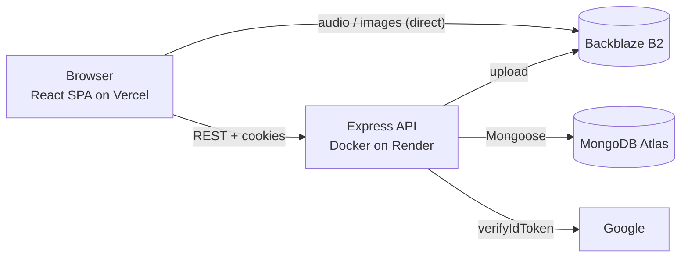
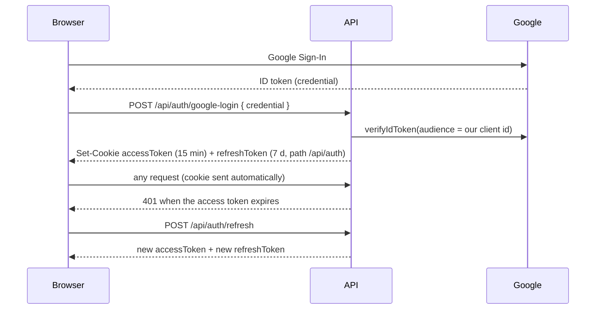
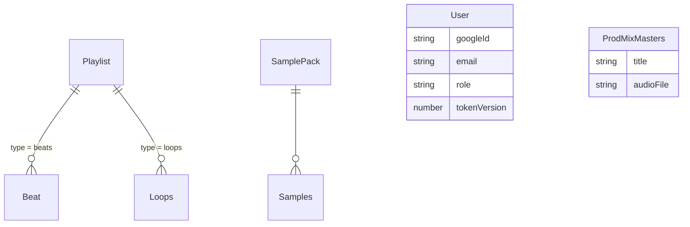

# Architecture

## Overview

The API never serves audio. It stores the public B2 URL in Mongo, and the browser plays the file directly from B2. The one exception is `/api/download` (see below).

## Request pipeline

`helmet → compression → rate limit (100/min per IP) → CORS → auth rate limit (only /api/auth) → cookie-parser → JSON body (1 MB) → routes → 404 → errorHandler`

- Rate limiting is per client IP only because of `app.set('trust proxy', 1)`. Without it, every request on Render comes from the proxy's IP.
- CORS only allows `FRONTEND_URL` and the production domain. A blocked origin gets a 403 with code `CORS_NOT_ALLOWED`.
- Every error ends up in `middleware/errorHandler.js`. Mongoose validation, cast and duplicate-key errors and JWT errors are mapped to 4xx codes. In production, a 500 doesn't expose the internal message.

## Authentication

- Both cookies are `httpOnly; Secure; SameSite=None`. `None` is required because the frontend (vercel.app) and the API (onrender.com) are on different sites. The CORS allowlist is what stops other sites from using those cookies.
- The refresh token carries the user's `tokenVersion`. Logout increments it, so any refresh token issued before that stops working.
- `adminAuth` doesn't trust the `role` in the JWT: it loads the user and checks the role in the database on every request.

## Files and B2

`services/b2Service.js` validates type and size, sanitizes the name, adds a timestamp prefix and uploads under `<folder>/`. Retries back off exponentially (0.5 s, 1 s), and a 401/403 forces a new B2 authorization. The public URL has the form `<B2_PUBLIC_URL>/<B2_BUCKET_NAME>/<folder>/<file>`.

Multer holds uploads in memory, which is why there's a hard cap of 100 MB per file and 10 files per batch.

## Download proxy

Browsers ignore `<a download>` for cross-origin files, so "download" on a B2 URL would just open the player. `/api/download?url=` streams the file back with `Content-Disposition: attachment`.

The URL comes from the client, so this is an SSRF risk if it isn't restricted. `utils/downloadSource.js` accepts only `https` URLs whose host ends in `.backblazeb2.com` and whose path or subdomain names our bucket. Look-alike hosts, credentials in the URL, other buckets and plain http are all rejected. The cases are in `tests/downloadSource.test.js`.

## Data model

`Playlist.type` decides which collection its items live in. The admin routes refuse to create a beat in a loops playlist and vice versa.
